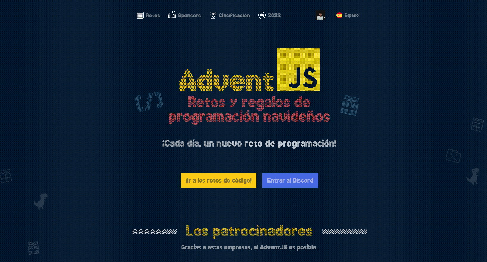

Actualemente AdventJS tiene 3 versiones, 2021 - 2022 - 2023 
Cada una de ellas consta de 24-25 ejercicios, entre las siguientes categorias:

 **Dificultad**: 🟢 Facil 🟠 Media 🔴 Dificil 🟣 Muy Dificil
### 🕹️ Challenges AdventJS2022

|  #  |                Challenge                 | Dificultad|                   Descripción                   |             Solucion              |
| :-: | :--------------------------------------: | :------------: | :---------------------------------------------: | :--------------------------------------------: |
| 01  |   Primer regalo repetido    |       🟢       | [Mostrar](https://adventjs.dev/challenges/2022/1)  |  [Solve](https://github.com/Savecoders/Solve-AdventJS/tree/main/solves/2023/Challenge01/main.ts)  |
| 02  |   Ponemos en marcha la Fabrica  |       🟢       | [Mostrar](https://adventjs.dev/challenges/2022/2)  | [Solve](tps://github.com/Savecoders/Solve-AdventJS/tree/main/solves/2023/Challenge02/main.ts)  |)  |
| 03  |   Reto #3: 😏 El elfo travieso |       🟢       | [Mostrar](https://adventjs.dev/challenges/2022/3)  | [Solve](https://github.com/Savecoders/Solve-AdventJS/tree/main/solves/2023/Challenge03/main.ts)  |
| 04  |   Reto #4: 😵‍💫 Dale la vuelta a los paréntesis     |       🟠       | [Mostrar](https://adventjs.dev/challenges/2022/4)  | [Solve](https://github.com/Savecoders/Solve-AdventJS/tree/main/solves/2023/Challenge04/main.ts)  |
| 05  |   Reto #5: 🛷 El CyberTruck de Santa       |       🟠       | [Mostrar](https://adventjs.dev/challenges/2022/5)  | [Solve](https://github.com/Savecoders/Solve-AdventJS/tree/main/solves/2023/Challenge05/main.ts)  |
| 06  |   Reto #6: 🦌 Los renos a prueba        |       🟢       | [Mostrar](https://adventjs.dev/challenges/2022/6)  | [Solve](https://github.com/Savecoders/Solve-AdventJS/tree/main/solves/2023/Challenge06/main.ts)  |
| 07  |   Reto #7: 📦 Las cajas en 3D           |       🟢       | [Mostrar](https://adventjs.dev/challenges/2022/7)  | [Solve](https://github.com/Savecoders/Solve-AdventJS/tree/main/solves/2023/Challenge07/main.ts)  |
| 08  |   Reto #8: 🏬 Ordenando el almacén         |       🟠       | [Mostrar](https://adventjs.dev/challenges/2022/8)  | [Solve](https://github.com/Savecoders/Solve-AdventJS/tree/main/solves/2023/Challenge08/main.ts)  |
| 09  |   Reto #9: 🚦 Alterna las luces            |       🟢       | [Mostrar](https://adventjs.dev/challenges/2022/9)  | [Solve](https://github.com/Savecoders/Solve-AdventJS/tree/main/solves/2023/Challenge09/main.ts)  |
| 10  |   Reto #10: 🎄 Crea tu propio árbol de navidad      |       🟢       | [Mostrar](https://adventjs.dev/challenges/2022/10) | [Solve](https://github.com/Savecoders/Solve-AdventJS/tree/main/solves/2023/Challenge10/main.ts)  |
| 11  |   Reto #11: 📖 Los elfos estudiosos        |       🟠       | [Mostrar](https://adventjs.dev/challenges/2022/11) | [Solve](https://github.com/Savecoders/Solve-AdventJS/tree/main/solves/2023/Challenge11/main.ts)  |
| 12  |   Reto #12: 📸 ¿Es una copia válida?          |       🟠       | [Mostrar](https://adventjs.dev/challenges/2022/12) | [Solve](https://github.com/Savecoders/Solve-AdventJS/tree/main/solves/2023/Challenge12/main.ts)  |
| 13  |   Reto #13: ⌚️ Calculando el tiempo       |       🟢       | [Mostrar](https://adventjs.dev/challenges/2022/13) | [Solve](https://github.com/Savecoders/Solve-AdventJS/tree/main/solves/2023/Challenge13/main.ts)  |
| 14  |   Reto #14: 🚨 Evita la alarma        |       🟠       | [Mostrar](https://adventjs.dev/challenges/2022/14) | [Solve](https://github.com/Savecoders/Solve-AdventJS/tree/main/solves/2023/Challenge14/main.ts)  |
| 15  |   Reto #15: ↔️ Robot autónomo       |       🟠       | [Mostrar](https://adventjs.dev/challenges/2022/15) | [Solve](https://github.com/Savecoders/Solve-AdventJS/tree/main/solves/2023/Challenge15/main.ts)  |
| 16  |   Reto #16: ❌ Despliegue en viernes       |       🟢       | [Mostrar](https://adventjs.dev/challenges/2022/16) | [Solve](https://github.com/Savecoders/Solve-AdventJS/tree/main/solves/2023/Challenge16/main.ts)  |
| 17  |   Reto #17: 🛷 Optimizando el alquiler          |       🟠       | [Mostrar](https://adventjs.dev/challenges/2022/17) | [Solve](https://github.com/Savecoders/Solve-AdventJS/tree/main/solves/2023/Challenge17/main.ts)  |
| 18  |   Reto #18: 🔢 El reloj digital        |       🔴      | [Mostrar](https://adventjs.dev/challenges/2022/18) | [Solve](https://github.com/Savecoders/Solve-AdventJS/tree/main/solves/2023/Challenge18/main.ts)  |
| 19  |   Reto #19: 💣 Enfrenta el sabotaje             |       🟢       | [Mostrar](https://adventjs.dev/challenges/2022/19) | [Solve](https://github.com/Savecoders/Solve-AdventJS/tree/main/solves/2023/Challenge19/main.ts)  |
| 20  |   Reto #20: 🏋️‍♂️ Distribuye el peso          |       🔴       | [Mostrar](https://adventjs.dev/challenges/2022/20) | [Solve](https://github.com/Savecoders/Solve-AdventJS/tree/main/solves/2023/Challenge20/main.ts)  |
| 21  |   Reto #21: 🪐 Mensaje binario         |       🟠       | [Mostrar](https://adventjs.dev/challenges/2022/21) |[Solve](https://github.com/Savecoders/Solve-AdventJS/tree/main/solves/2023/Challenge21/main.ts)  |
| 22  |   Reto #22: 🚂 Lenguaje de programación            |       🟢       | [Mostrar](https://adventjs.dev/challenges/2022/22) | [Solve](https://github.com/Savecoders/Solve-AdventJS/tree/main/solves/2023/Challenge22/main.ts)  |
| 23  |   Reto #23: 🍽️ La comida de Navidad          |       🟢       | [Mostrar](https://adventjs.dev/challenges/2022/23) | [Solve](https://github.com/Savecoders/Solve-AdventJS/tree/main/solves/2023/Challenge23/main.ts)  |
| 24  |   Reto #24: 🪜 Brincos en la escalera       |       🟠       | [Mostrar](https://adventjs.dev/challenges/2022/24) | [Solve](https://github.com/Savecoders/Solve-AdventJS/tree/main/solves/2023/Challenge24/main.ts)  |
| 25  |   Reto #25: 🎁 Calculando las distancias         |       🟠       | [Mostrar](https://adventjs.dev/challenges/2022/25) | [Solve](https//://github.com/Savecoders/Solve-AdventJS/tree/main/solves/2023/Challenge25/main.ts)  |
