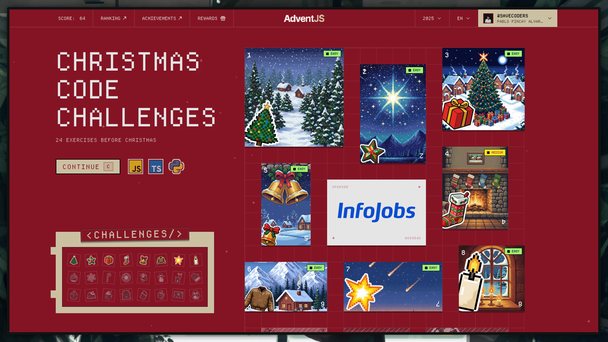

Actualemente AdventJS tiene 5 versiones, 2021 - 2022 - 2023 - 2024 - 2025
Cada una de ellas consta de 24-25 ejercicios, entre las siguientes categorias:

 **Dificultad**: 🟢 Facil 🟠 Media 🔴 Dificil 🟣 Muy Dificil

### 🕹️ Challenges AdventJS2025

|  #  |                Challenge                 | Dificultad|                   Descripción                   |             Solucion              |
| :-: | :--------------------------------------: | :------------: | :---------------------------------------------: | :--------------------------------------------: |
| 01  |   Primer regalo repetido    |       🟢       | [Mostrar](https://adventjs.dev/challenges/2025/1)  |  [Solve](https://github.com/Savecoders/Solve-AdventJS/tree/main/solves/2025/Challenge01/main.ts)  |
| 02  |   Ponemos en marcha la Fabrica  |       🟢       | [Mostrar](https://adventjs.dev/challenges/2025/2)  | [Solve](https://github.com/Savecoders/Solve-AdventJS/tree/main/solves/2025/Challenge02/main.ts)  |
| 03  |   😏 El elfo travieso |       🟢       | [Mostrar](https://adventjs.dev/challenges/2025/3)  | [Solve](https://github.com/Savecoders/Solve-AdventJS/tree/main/solves/2025/Challenge03/main.ts)  |
| 04  |   😵‍💫 Dale la vuelta a los paréntesis     |       🟠       | [Mostrar](https://adventjs.dev/challenges/2025/4)  | [Solve](https://github.com/Savecoders/Solve-AdventJS/tree/main/solves/2025/Challenge04/main.ts)  |
| 05  |   🛷 El CyberTruck de Santa       |       🟠       | [Mostrar](https://adventjs.dev/challenges/2025/5)  | [Solve](https://github.com/Savecoders/Solve-AdventJS/tree/main/solves/2025/Challenge05/main.ts)  |
| 06  |   🦌 Los renos a prueba        |       🟢       | [Mostrar](https://adventjs.dev/challenges/2025/6)  | [Solve](https://github.com/Savecoders/Solve-AdventJS/tree/main/solves/2025/Challenge06/main.ts)  |
| 07  |   📦 Las cajas en 3D           |       🟢       | [Mostrar](https://adventjs.dev/challenges/2025/7)  | [Solve](https://github.com/Savecoders/Solve-AdventJS/tree/main/solves/2025/Challenge07/main.ts)  |
| 08  |   🏬 Ordenando el almacén         |       🟠       | [Mostrar](https://adventjs.dev/challenges/2025/8)  | [Solve](https://github.com/Savecoders/Solve-AdventJS/tree/main/solves/2025/Challenge08/main.ts)  |
| 09  |   🎅 El reno robot aspirador    |       🔴       | [Mostrar](https://adventjs.dev/challenges/2025/9)  | [Solve](https://github.com/Savecoders/Solve-AdventJS/tree/main/solves/2025/Challenge09/main.ts) |
| 10  |   🧑‍🎄 Profundidad de la magia Navidad      |       🟠       | [Mostrar](https://adventjs.dev/challenges/2025/10) | [Solve](https://github.com/Savecoders/Solve-AdventJS/tree/main/solves/2025/Challenge10/main.ts) |
| 11  |   🧩 Regalos sin vigilancia       |       🟢       | [Mostrar](https://adventjs.dev/challenges/2025/11) | [Solve](https://github.com/Savecoders/Solve-AdventJS/tree/main/solves/2025/Challenge11/main.ts) |
| 12  |   🎄 Batala de Elfos    |       🟠       | [Mostrar](https://adventjs.dev/challenges/2025/12) | [Solve](https://github.com/Savecoders/Solve-AdventJS/tree/main/solves/2025/Challenge12/main.ts) |
| 13  |   🧸 La cadena de Montaje        |       🟠       | [Mostrar](https://adventjs.dev/challenges/2025/13) | [Solve](https://github.com/Savecoders/Solve-AdventJS/tree/main/solves/2025/Challenge13/main.ts) |
| 14  |   🎁 Encuentra el camino al regalo         |       🟢       | [Mostrar](https://adventjs.dev/challenges/2025/14) | [Solve](https://github.com/Savecoders/Solve-AdventJS/tree/main/solves/2025/Challenge14/main.ts) |
| 15  |   🛷 Dibujando Tablas     |       🟠       | [Mostrar](https://adventjs.dev/challenges/2025/15) | [Solve](https://github.com/Savecoders/Solve-AdventJS/tree/main/solves/2025/Challenge15/main.ts) |
| 16  |   🧩 Empaquentando regalos para santa       |       🟢       | [Mostrar](https://adventjs.dev/challenges/2025/16) | [Solve](https://github.com/Savecoders/Solve-AdventJS/tree/main/solves/2025/Challenge16/main.ts) |
| 17  |   🧩 El panel de luces Navidad       |       🟢       | [Mostrar](https://adventjs.dev/challenges/2025/17) | [Solve](https://github.com/Savecoders/Solve-AdventJS/tree/main/solves/2025/Challenge17/main.ts) |
| 18  |   🧩 Luces en linea con diagonales      |       🟠       | [Mostrar](https://adventjs.dev/challenges/2025/18) | [Solve](https://github.com/Savecoders/Solve-AdventJS/tree/main/solves/2025/Challenge18/main.ts) |
| 19  |   🎄 El viaje secreto de Papa Nuel       |       🟢       | [Mostrar](https://adventjs.dev/challenges/2025/19) | [Solve](https://github.com/Savecoders/Solve-AdventJS/tree/main/solves/2025/Challenge19/main.ts) |
| 20  |   🎄 El Almacen vertical       |       🟢       | [Mostrar](https://adventjs.dev/challenges/2025/20) | [Solve](https://github.com/Savecoders/Solve-AdventJS/tree/main/solves/2025/Challenge20/main.ts) |
| 21  |   😏 El Robot de limpieza      |       🟠       | [Mostrar](https://adventjs.dev/challenges/2025/21) | [Solve](https://github.com/Savecoders/Solve-AdventJS/tree/main/solves/2025/Challenge21/main.ts) |
| 22  |   🛷 El laberinto del trineo    |       🔴       | [Mostrar](https://adventjs.dev/challenges/2025/22)  | [Solve](https://github.com/Savecoders/Solve-AdventJS/tree/main/solves/2025/Challenge22/main.ts) |
| 23  |   🎁 Ruta de regalos      |       🟠       | [Mostrar](https://adventjs.dev/challenges/2025/23) | [Solve](https://github.com/Savecoders/Solve-AdventJS/tree/main/solves/2025/Challenge23/main.ts) |
| 24  |   🎄 Verifica si los arboles son espejos      |       🟠       | [Mostrar](https://adventjs.dev/challenges/2025/24) | [Solve](https://github.com/Savecoders/Solve-AdventJS/tree/main/solves/2025/Challenge24/main.ts) |
| 25  |   Reto #5: 🛷 Ejecuta el lenguaje magico      |       🟠       | [Mostrar](https://adventjs.dev/challenges/2025/25)  | [Solve](https://github.com/Savecoders/Solve-AdventJS/tree/main/solves/2025/Challenge25/main.ts)  |
